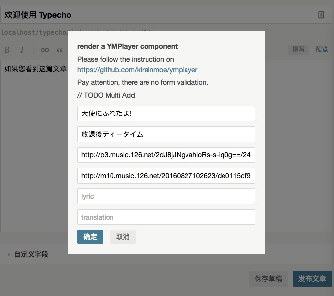

# Typecho Plugin YMPlayer
A typecho plugin for YMPlayer https://github.com/kirainmoe/ymplayer




## 介绍
1. 通过简短的代码在文章或页面中插入漂亮的 HTML5 播放器
2. 与 ymplayer 保持同步更新
3. 不再提供直接插入网易云外链的方式

## 安装方法
### 常规方法
由于直接通过 GitHub Download ZIP 并不会连带下载 submodule，所以需要做一些额外的工作。

- Download ZIP，解压到 **/usr/plugin/** 下，并将插件目录名改为 **ymplayer**.
- 登录后台激活插件，会提示安装 submodule ，如果服务器可写，插件会自动安装。
- 如果服务器不可写或安装失败，请前往 https://github.com/kirainmoe/ymplayer 下载项目 ZIP，并解压到 **/usr/plugin/ymplayer/submodule/ymplayer** 下。
- 完成后请确保 **http://yourdomain/usr/plugin/ymplayer/submodule/ymplayer/dist/assets/ymplayer.js** 可以通过浏览器正常访问，即表示安装完成。

### 使用git安装
```bash
#安装插件
$ cd /path/to/your/typecho/usr/plugin/
$ git clone https://github.com/kokororin/typecho-plugin-ymplayer ymplayer
$ cd ymplayer
$ chown -R www:www * 
#更新插件 
$ cd /path/to/your/typecho/usr/plugin/ymplayer
$ git pull
$ chown -R www:www *
```


## 使用方法

在文章编辑页面中，在要插入播放器的部分点击工具栏按钮。

### 更新 ymplayer
```bash
$ git submodule update
```


## LICENSE

制作过程中参考了[kirainmoe](https://github.com/kirainmoe)和[journey-ad](https://github.com/journey-ad)二位的代码，特此感谢

GPL v2
